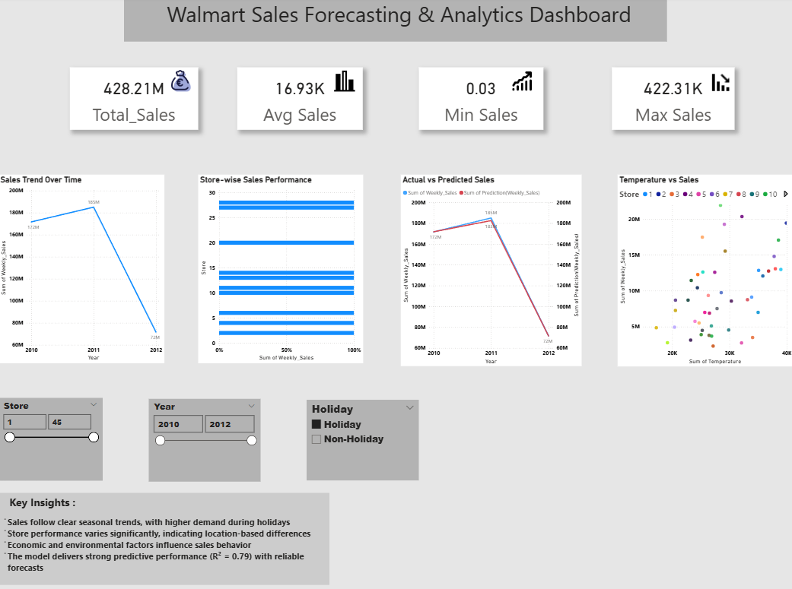
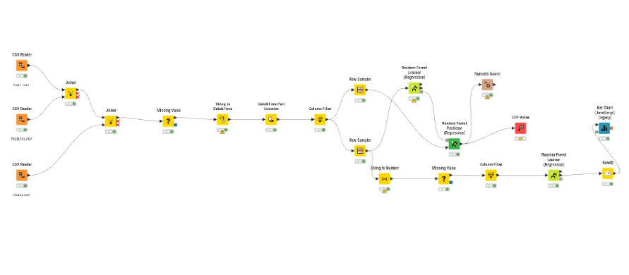

# 📊 Walmart Sales Forecasting and Analytics Using Machine Learning

## 📌 Project Overview
This project focuses on analyzing and predicting Walmart sales using Machine Learning techniques and visualizing insights through an interactive dashboard.

A Random Forest Regression model is implemented using KNIME to capture complex patterns in sales data. The results are visualized using Power BI for business insights.

---

## 🚀 Tools & Technologies
- KNIME (Data Processing & Machine Learning)
- Power BI (Dashboard & Visualization)
- Machine Learning (Random Forest Regression)

---

## 📊 Key Features
- Sales trend analysis over time
- Store-wise performance comparison
- Actual vs Predicted sales analysis
- Interactive dashboard with filters
- KPI metrics (Total, Average, Min, Max Sales)

---

## 🤖 Model Performance
- R² Score: **0.79**
- Indicates strong predictive performance

---

## 🔄 Workflow

### 🔹 KNIME Workflow
CSV Reader → Data Preprocessing → Random Forest Model → Prediction → Evaluation

### 🔹 Dashboard Workflow
Data → Power BI → Visualization → Insights

---

## 📷 Project Screenshots

### 📊 Power BI Dashboard

### 🔧 KNIME Workflow

---
## 📁 Project Structure

walmart-sales-prediction/
┣ datasets/
┣ Images/
┣ walmart sales prediction.knwf
┣ walmart sales prediction dashboard.pbix
┣ report.pdf
┣ readme.md

---
## ⚙️ How to Run

1. Open KNIME workflow file
2. Execute nodes to generate predictions
3. Open Power BI `.pbix` file
4. Explore dashboard and insights

---

## 🎯 Key Insights
- Sales show seasonal trends
- Store performance varies significantly
- External factors influence sales
- Model predictions align closely with actual values

---

## 📚 References & Resources
- KNIME Documentation
- Power BI Documentation
- L. Breiman, Random Forests
- Kaggle Walmart Dataset

---

## 📌 Note
This project was originally developed as part of an academic curriculum and has been refined for portfolio presentation.

- Developed by SREERAG 
